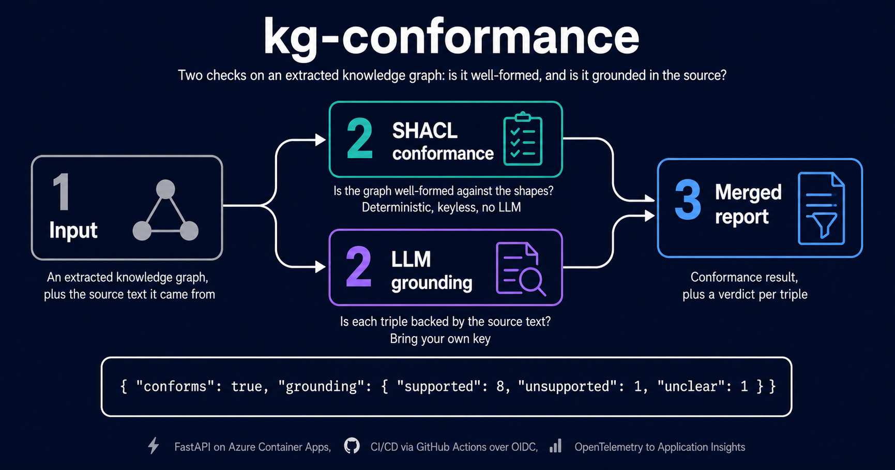
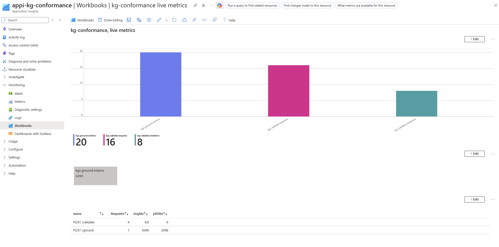

# kg-conformance

[](https://www.python.org/downloads/)
[](LICENSE)
[](#tests)
[](https://github.com/Tomislav-Sola/kg-conformance/releases)

<p align="center">
  
</p>

A small HTTP service that checks an already-extracted knowledge graph on two
orthogonal axes:

- **Conformance** (`/validate`): is the graph well-formed against an ontology
  expressed as SHACL shapes? Deterministic, runs `rdflib` + `pyshacl` with no
  model call. Keyless and free.
- **Source-grounding** (`/ground`): is each triple actually supported by the
  source text it was extracted from, or was it hallucinated? This uses a
  language model. Bring your own Anthropic key (BYOK).

The two checks are independent: you can run conformance on its own, or grounding
on its own. The service consumes triples produced elsewhere (a graph builder,
GraphRAG, your own pipeline); it does not extract the graph for you, and it is
not a general guardrail framework.

### What grounding does, and does not, do

Each triple is rendered to a short claim and checked against the source text in
a batched model call (a Haiku-class model, split across several batches for
large graphs), returning a verdict per triple: `supported`, `unsupported`, or
`unclear`, each with a one-line justification.
It is a textual-entailment heuristic, not a proof: the model can be wrong, so
treat the verdicts as a signal, not a guarantee. Inputs are bounded
(`max_triples`, a source-text length cap), and the call is **fail-open**: if the
model is unavailable, the response comes back with grounding marked
`unavailable` rather than failing the request.

## Live demo

Conformance is open and free; grounding needs your own key.

- Base URL: `https://ca-kg-conformance.jollydesert-dd392428.germanywestcentral.azurecontainerapps.io`
- Interactive API (Swagger UI): append `/docs` to the base URL.
- `GET /demo`: a keyless, precomputed grounding example, so you can see what
  `/ground` produces without a key. Send the same input to `/ground` with your
  own key to run it live.

The app scales to zero, so the first request after an idle period pays a short
cold start.

## API

`POST /validate` (keyless, free, deterministic)
- `data`: Turtle, the extracted triples
- `shapes`: Turtle, the SHACL shapes

Returns the SHACL conformance report (`conforms` plus `violations`).

`POST /ground` (BYOK)
- `source_text`: the text the triples should be grounded in
- `data`: Turtle, the triples to check
- `X-Anthropic-Key` header: your Anthropic key

Returns a verdict per triple with a justification, a verdict-count summary, and
the token cost. The key is used only for that request and is never logged or
stored.

`GET /demo` (keyless) returns a precomputed grounding example: the example
input, a frozen report from a real run, and metadata marking it as precomputed.

`GET /health` for a liveness check.

## Architecture

- **FastAPI** on **Azure Container Apps** (Consumption plan, scale-to-zero).
- **CI/CD** via GitHub Actions: on push to `main`, run the tests, build the
  image and push it to GitHub Container Registry, then deploy to Azure over
  **OIDC** (no stored cloud credentials).
- **Observability**: OpenTelemetry traces and a focused set of custom metrics
  exported to Azure Application Insights, with sampling. The BYOK key is
  actively scrubbed and never reaches a span or a log record.
- **Two layers, kept separate**: conformance is deterministic (`pyshacl`);
  grounding sits behind a single `ClaudeClient` gateway, the only place the
  Anthropic SDK is instantiated.

## Run locally

```
git clone https://github.com/Tomislav-Sola/kg-conformance.git
cd kg-conformance
python3 -m venv .venv
.venv/bin/pip install -e ".[dev]"
.venv/bin/pytest
.venv/bin/uvicorn app.main:app --reload
```

Then open `http://127.0.0.1:8000/docs` and try `/validate`. For `/ground`, send
your Anthropic key in the `X-Anthropic-Key` header. Telemetry export stays off
unless `APPLICATIONINSIGHTS_CONNECTION_STRING` is set, so local runs export
nothing.

## Tests

```
.venv/bin/pytest
```

The grounding tests mock the `ClaudeClient`, so the suite makes no real
Anthropic call and needs no key. Line coverage is 86% (the gateway's live SDK
paths are mocked, not exercised); measure it with:

```
.venv/bin/pytest --cov=app
```

## Observability

<p align="center">
  
</p>

A live Azure Application Insights workbook, fed by the OpenTelemetry custom metrics the deployed service emits (validate conforms and violations, grounding verdict counts, grounding token usage, fail-open degradations) alongside request latency.

The latency split is the interesting part: deterministic SHACL validation (`POST /validate`) runs in single-digit milliseconds, while the LLM grounding call (`POST /ground`) runs around three seconds, which is why grounding is a separate opt-in endpoint and the model is invoked only where it adds value. These figures come from a small manual traffic run that exercises the pipeline, not a benchmark or a load test, so the per-request latency shown is illustrative rather than a statistically meaningful percentile.

The dashboard is reproducible: [`docs/workbook.arm.json`](docs/workbook.arm.json) is the workbook definition as code, a deployable ARM template, not just the screenshot above.

## Stack

Python 3.12, FastAPI and uvicorn, `rdflib` and `pyshacl` for the deterministic
conformance layer, the Anthropic SDK (behind a single client gateway) for
grounding, Pydantic, OpenTelemetry with the Azure Monitor exporter. Containerized
for Azure Container Apps.

## License

MIT. See [LICENSE](LICENSE).
